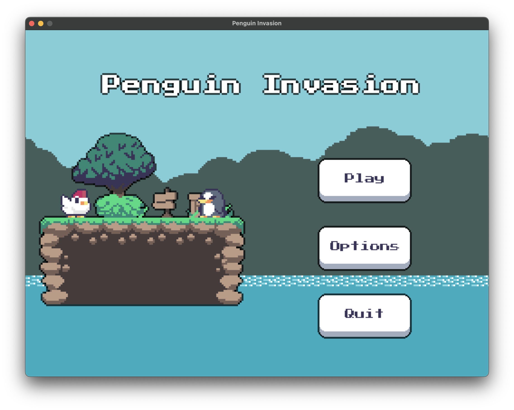

# Penguin Invasion

Penguin Invasion is a Python game made using PyGame-CE library. It's my second game I'm making using pygame.

## About Penguin Invasion

Penguin Invasion is a 2D platformer where you play as a chicken trying to avoid blind penguins that have invaded the Grassland, your home. Despite their blindness, these penguins possess a dangerous power: touching them causes an explosion! So, be cautious and navigate carefully. Your mission is to reach the Arctic to save the Frozen Shark, the only creature capable of defeating the penguins. You are the last hope for the animals of the Grassland!

**Menu:**

**Game:**

**Simple Level Editor:**

**Paused:**

**Options:**

It's my second Pygame game and the first one that's using OOP. This game is based on tutorials from Clear Code, Coding with Russ, DaFluffyPotato, and others. It's still a work in progress, but it's finally playable. I will gradually update it and hopefully make it a playable, fun, short game.

## How to run the game

**You have two choices:**
1. Run the game via game.exe file inside the `windows_version.zip` in release folder

2. Run the game via **terminal** using `python game.py` command. (You need to have pygame-ce installed)

**Install pygame-ce:**
1. Open terminal
2. If you have pygame already installed run `pip uninstall pygame`
3. Run `pip install pygame-ce`
4. Done 😁

## Updates
*In the form of a concise list*

**Version: 1.5**
- Made levels
- Made gems counter
- Changed gems colours
- Added "ending"
- Added .exe file to run the game

**Version: 1.4**
- Added pickable entities (gems)
- Player now have to pick up all gems before going to the next level
- Changed editor file path
- Added camera boundaries (left and down only)
- Added gem sound

**Version: 1.3.3**
- Made a parralax effect for the background trees
- First level for now is a test island

**Version: 1.3.2**
- Added camera movement to the editor
- Added player spawn point indicator to the editor

**Version: 1.3**
- Added camera movement, I think it will suit the gameplay better

**Version: 1.2**
- Made option menu
- Player is now able to change volume of every sound in the game

**Version: 1.1.2**
- Started working on option menu
- Updated few things related to text display

**Version: 1.1**
- Added pause menu
- Added options button for later use
- Some other minor changes
- Made some UI changes (new menu screen layout, background and colors)

**Version: 1.0**
- Added menu
- Added sounds
- Added pausing
- Fixed minor bugs
- The game is kinda done :)

**Version: 0.9**
- Added level ending object (the sign)
- Added transitions after death and when player complete the level
- Fixed grass texture
- Added outline to almost everything (thru code)

**Version: 0.8**
- Added death for the player
- Added particles (blood when players die) and script that handles them
- Added screenshake
- Added new map loading function, so now there can be multiple levels
- Fixed levitating player when running

**Version: 0.7**
- Added class for enemies
- Made spawners for enemies and player
- Made function to extract those spawners from tilemap
- Enemies for now just go in one direction and walk off the edge
- **Quick fix** - *Enemies now won't walk off the edge and also won't walk into a wall*

**Version: 0.6**
- Added ability to double jump, before the Player could jump infinitely
- Did some minor changes
- Fixed little bugs

**Version: 0.5**
- Added editor to make and edit levels
- Made some minor changes in tilemap script
- Now map in game is from JSON file :)

**Version: 0.4**
- Added animations to the Player
- Added background and moving clouds
- Made separate class for Player that inherits from PhysicsEntity

**Version: 0.3**
- Added tilemap script that handles making tiles
- Added collisions for entities and tiles
- Added ability to jump
- Refined getting rect from entity (using FRect now)

**Version: 0.2**
- Made entities script for handling entities logic such as player (and enemies in the future)
- Made utils script that handles utility stuff such as getting images
- Made assets variable that contains a dictionary with all assets that will be used in the game

**Version: 0.1**
- Made basic setup for pygame games
- Basic collision test